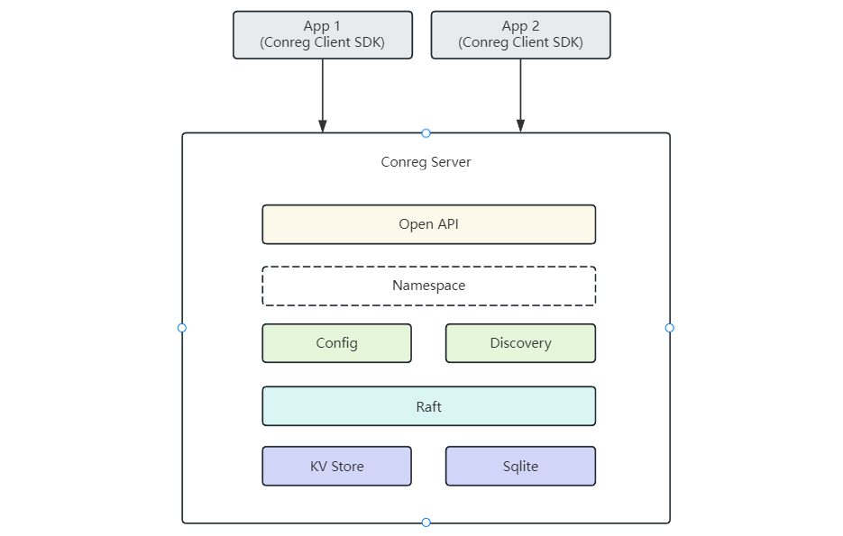

# Conreg

Configuration and registry center implemented in Rust, referencing the design of Nacos, integrating configuration and
service discovery into one, simple and easy to use, supporting cluster deployment, CP mode, using Raft to ensure data
consistency.

Configuration Center:

- [x] Namespace isolation
- [x] Configuration CRUD operations
- [x] Consistency synchronization (Raft)
- [x] Configuration history records
- [x] Configuration recovery
- [ ] Configuration import/export
- [ ] Web UI

Registry Center:

- [x] Namespace isolation
- [x] Service registration
- [x] Heartbeat detection
- [ ] Service discovery
- [ ] Web UI
  Security:
- [ ] Login verification
- [ ] OpenAPI authentication

Client SDK（[conreg-client](https://docs.rs/conreg-client)）：

- [x] Configuration retrieval
- [x] Service registration
- [x] Service discovery
- [ ] Load balancing

Cluster Management Tool:

- [x] Cluster initialization
- [x] Cluster scaling out
- [x] Cluster scaling in
- [x] Raft status monitoring
- [ ] Cluster upgrade
- [ ] Cluster backup

# Overall Architecture



# Conreg Server

## Standalone Deployment

- Startup

```shell
conreg-server -p 8000
```

## Cluster Deployment

Single Node

- Manual Deployment

Start multiple nodes:

```shell
conreg-server -p 8001 -d ./data1 -m cluster -n 1
conreg-server -p 8002 -d ./data2 -m cluster -n 2
conreg-server -p 8003 -d ./data3 -m cluster -n 3
```

Initialization:

```shell
curl -X POST http://127.0.0.1:8001/init -d [[1,"127.0.0.1:8000"],[2,"127.0.0.1:8001"],[3,"127.0.0.1:8002"]]
```

- Using Cluster Management Tool
  A CLI tool for cluster management is provided for cluster creation, scaling, and scaling
  in:[conreg-cmt](https://crates.io/crates/conreg-cmt)

```shell
Usage: conreg-cmt --server <SERVER> <COMMAND>

Commands:
  init         Initialize the cluster
  add-learner  Add a learner node to the cluster
  promote      Promote some learner node to a full member, must call "add-learner" first
  remove-node  Remove a node from the cluster
  status       Get cluster status
  monitor      Monitor cluster status
  help         Print this message or the help of the given subcommand(s)

Options:
  -s, --server <SERVER>  Address of any node in the cluster [default: 127.0.0.1:8000]
  -h, --help             Print help
  -V, --version          Print version
```