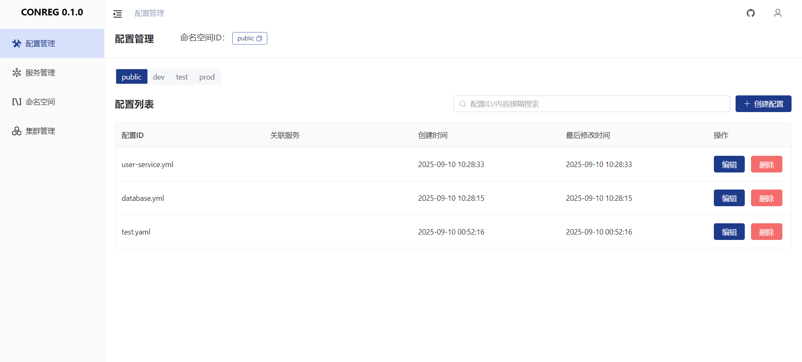

<div align="center">
  


[中文](README_zh.md) | [English](README.md)
</div>

# Introduction

Configuration and registry center implemented in Rust, referencing the design of Nacos, simple and easy to use, using
Raft to ensure data consistency across cluster nodes.

If you are building distributed or microservices applications using Rust, Conreg might be a good choice.

Supported platforms:

- Ubuntu
- CentOS
- Other common Linux distributions (we compile with `musl`, theoretically supporting all major Linux distributions)

# Features

Configuration Center:

- [x] Namespace isolation
- [x] Configuration CRUD operations
- [x] Consistency synchronization (Raft)
- [x] Configuration history records
- [x] Configuration recovery
- [x] Configuration import/export

Registry Center:

- [x] Namespace isolation
- [x] Service registration
- [x] Heartbeat detection
- [ ] Service discovery
- [x] Instance metadata

Security:

- [x] Login verification
- [ ] OpenAPI authentication
- [ ] Configuration content encryption

Client SDK（[conreg-client](https://docs.rs/conreg-client)）：

- [x] Configuration retrieval
- [x] Service registration
- [x] Service discovery
- [x] Load balancing

Cluster Management Tool:

- [x] Cluster initialization
- [x] Cluster scaling out
- [x] Cluster scaling in
- [x] Raft status monitoring
- [ ] Cluster upgrade
- [ ] Cluster backup

Web UI:

- [x] Basic UI
- [ ] Embedding and Integration

# How to use

## Conreg Server

### Standalone Deployment

```shell
# Download package
curl -L https://github.com/xgpxg/conreg/releases/latest/download/conreg-server.tar.gz | tar -zxvf - -C .

# Start server
conreg-server -p 8000
```

Open with browser: http://127.0.0.1:8000

Default username and password: conreg/conreg

### Cluster Deployment

In production environments, cluster deployment is generally recommended. The following example uses a 3-node cluster:

```shell
# Download package
curl -L https://github.com/xgpxg/conreg/releases/latest/download/conreg-server.tar.gz 

# Unzip package
tar -zxvf conreg-server.tar.gz -C ./conreg1
tar -zxvf conreg-server.tar.gz -C ./conreg2
tar -zxvf conreg-server.tar.gz -C ./conreg3

# Start server
conreg1/conreg-server -p 8001 -d ./conreg1/data1 -m cluster -n 1
conreg2/conreg-server -p 8002 -d ./conreg2/data2 -m cluster -n 2
conreg3/conreg-server -p 8003 -d ./conreg3/data3 -m cluster -n 3

# Initialize cluster
curl -X POST http://127.0.0.1:8001/api/cluster/init -d [[1,"127.0.0.1:8001"],[2,"127.0.0.1:8002"],[3,"127.0.0.1:8003"]]
```

You can use proxy components, such as Nginx, to proxy cluster nodes so that you can view the backend pages through a
browser, or you can directly access any node in the cluster.

For cluster management (such as initialization, scaling out, scaling in, monitoring, etc.), we provide a CLI tool for
cluster management: [conreg-cmt](https://crates.io/crates/conreg-cmt), which can be used conveniently

```shell
Usage: conreg-cmt --server <SERVER> <COMMAND>

Commands:
  init         Initialize the cluster
  add-learner  Add a learner node to the cluster
  promote      Promote some learner node to a full member, must call "add-learner" first
  remove-node  Remove a node from the cluster
  status       Get cluster status
  monitor      Monitor cluster status
  help         Print this message or the help of the given subcommand(s)

Options:
  -s, --server <SERVER>  Address of any node in the cluster [default: 127.0.0.1:8000]
  -h, --help             Print help
  -V, --version          Print version
```

## Conreg Client

conreg-client is a client SDK for Conreg, used for integration into your Rust applications.

For example, you can easily get the configuration content using `AppConfig::get('key')` without restarting the
application.

You can view the detailed documentation from [conreg-client](https://docs.rs/conreg-client)

# UI

Look here: [conreg-ui](https://github.com/xgpxg/conreg-ui)



# Performance

Test machine (Windows WSL): Intel i7-8750H, 6 cores 12 threads, 16G memory.

Tested with 1 million requests and use standalone mode.

| Operation                     | Performance | Notes                 |
|-------------------------------|-------------|-----------------------|
| Configuration write           | 1.3k/s      | -                     |
| Configuration read            | 11k/s       | Without cache enabled |
| Configuration read            | 52k/s       | With cache enabled    |
| Service instance registration | 1.1k/s      | -                     |
| Service instance query        | 55k/s       | -                     |
| Service instance heartbeat    | 1.4k/s      | -                     |

Memory stable usage at 55.7M
